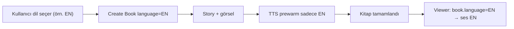
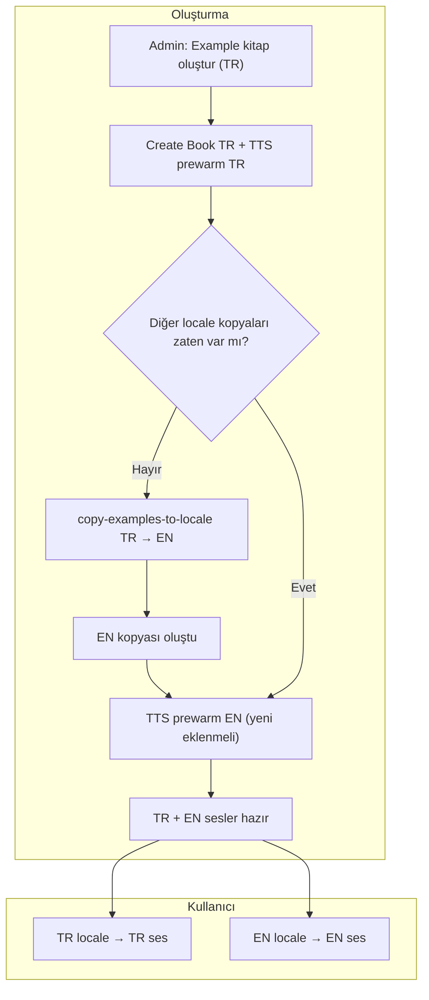
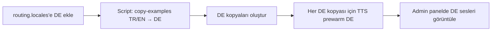

# TTS Dil Uyumsuzluğu ve Example Çok Dilli Ses Analizi

**Tarih:** 9 Mart 2026  
**Sorun:** Hikaye İngilizce seçilince kitap İngilizce ama ses Türkçe çıkıyor. TR seçilince ses doğru (Türkçe).  
**Ek gereksinim:** Example kitaplar için sitedeki tüm dillerde (şu an TR, EN) ses üretimi; yeni dil eklendiğinde script ile ses; admin panelden yönetim.

---

## 1. Mevcut Akış (Koddan)

- **Book viewer** TTS’i şu şekilde çağırıyor: `play(pageText, { language: book?.language || "en", ... })`.  
  Yani kitap dilini gönderiyor; kitap yoksa `"en"`.
- **API** (`POST /api/tts/generate`) gelen `language`’i `generateTts(..., { language: bodyLanguage })` ile backend’e iletiyor.
- **Backend** (`lib/tts/generate.ts`) dil sırasıyla şöyle seçiyor:
  1. İstekte gelen `options.language` (varsa ve dolu string)
  2. Yoksa global ayar: `ttsDefaults?.language_code` (DB’de varsayılan **`tr`**)
  3. O da yoksa `"en"`

Ses üretiminde kullanılan dil: `languageCode = getLanguageCode(language)` → Google TTS’e `voice: { languageCode, ... }` gidiyor; yani doğru dil koda çevriliyor.

---

## 2. Tespit Edilen Hatalar

### 2.1 Cache anahtarı dil içermiyor

- Cache hash: `text | voiceId | speed | prompt` (dil yok).
- **Prompt** seçimi: İstekte `prompt` yoksa `ttsDefaults?.prompt` (admin’in tek, global prompt’u) kullanılıyor.
- Admin özel prompt ayarladıysa **tüm diller** aynı prompt ile aynı hash’i üretir.
- Sonuç: Aynı metin önce bir dilde (örn. TR) üretilip cache’lendiğinde, başka dilde (örn. EN) istek gelince **aynı hash** ile cache’ten **yanlış dildeki ses** dönüyor.

**Örnek:** Önce Türkçe bir sayfa okutuldu → TR ses cache’lendi. Sonra aynı metinli İngilizce kitap açıldı → aynı hash, cache hit → Türkçe ses dönüyor.

### 2.2 Dil gönderilmezse global varsayılan “tr” kullanılıyor

- İstekte `language` yok veya boş string ise backend `ttsDefaults?.language_code` kullanıyor; migration’da varsayılan **`tr`**.
- Bu yüzden herhangi bir nedenden `language` gitmezse (ör. eski istemci, hata) ses hep Türkçe üretiliyor.

---

## 3. Çözüm Planı

| # | Yapılacak | Açıklama |
|---|-----------|----------|
| 1 | **Cache hash’e dil eklemek** | `generateCacheHash(text, voiceId, speed, prompt, languageCode)` şeklinde `languageCode`’u hash’e dahil et. Böylece aynı metin farklı dillerde farklı cache key’e sahip olur; EN kitap TR cache’ini kullanmaz. |
| 2 | **Frontend’i doğrulamak** | Tüm `play(...)` çağrılarında `language: book?.language || "en"` gönderildiğini kontrol et (şu an böyle). Kitap yüklenmeden oynatma yapılıyorsa `"en"` gidiyor; gerekirse kitap yokken play’i devre dışı bırak. |
| 3 | **Backend dil önceliği** | İstekte dil yoksa bile, “kitap sesi” senaryosunda yanlış dil kullanmamak için: dil boş/undefined ise global default yerine `"en"` kullanmak mantıklı olabilir (isteğe bağlı). Asıl kalıcı çözüm: cache’in dile göre ayrılması (madde 1). |

---

## 4. Özet

- **Neden EN kitap TR ses veriyor?**  
  1) Cache anahtarı dil içermiyor; admin prompt kullanıldığında aynı metin için tek cache paylaşılıyor ve ilk üretilen dil (TR) sonradan EN için de dönüyor.  
  2) Dil parametresi gitmezse backend varsayılan “tr” ile üretiyor.

- **Ne yapmalı?**  
  Cache hash’e `languageCode` ekleyerek aynı metnin farklı dillerde ayrı cache’lenmesini sağlamak; frontend’in her zaman kitap dilini göndermesini doğrulamak.

---

## 5. İlgili Dosyalar

- `lib/tts/generate.ts` — `generateCacheHash`, `generateTts` (dil + cache)
- `app/api/tts/generate/route.ts` — body’den `language` alıp iletme
- `hooks/useTTS.ts` — `play(text, { language })`
- `components/book-viewer/book-viewer.tsx` — `play(..., { language: book?.language || "en" })`
- `migrations/017_tts_settings.sql` — `language_code` default `'tr'`

---

## 6. Example Kitaplar: Çok Dilli Ses Gereksinimi

### 6.1 İstenen davranış

| Kitap türü | TTS davranışı |
|------------|----------------|
| **Normal kitap** | Sadece kitabın dili. Dil = istekte seçilen dil (örn. EN kitap → sadece EN ses). |
| **Example kitap** | Sitede açık olan **tüm dillerde** ses oluşsun. Şu an TR + EN; yarın DE eklenirse DE de. |

Mantık: Example'lar her locale'de görünsün (TR/EN/DE) ve kullanıcı hangi dilde açarsa o dilde ses duysun. Bunun için her dilde ayrı **kitap kopyası** (çeviri + aynı görseller) zaten var: `copy-examples-to-locale.ts`. Her kopyanın kendi dilinde TTS'i olmalı.

### 6.2 Mevcut durum

- **Normal kitap oluşturma:** Create Book akışında TTS prewarm sadece `language` (kitap dili) ile yapılıyor. Doğru.
- **Example kitap oluşturma:** Admin "Create example book" (Step6) ile tek dilde (örn. TR) kitap oluşturuluyor; TTS sadece o dilde prewarm ediliyor. Diğer diller (EN) için kopya ayrıca `copy-examples-to-locale.ts` ile oluşturuluyor ama bu script şu an **TTS prewarm çağırmıyor**; yani EN kopyası oluşunca EN ses üretilmiyor.
- **Sitedeki diller:** `i18n/routing.ts` → `locales: ['en', 'tr']`. Yeni dil (örn. DE) eklenince buraya eklenir.

### 6.3 Çözüm özeti

1. **Example oluşturulunca tüm site dillerinde ses:** Örnek tek dilde oluşturulduktan sonra (ve varsa diğer dil kopyaları da oluşturulduktan sonra), **her dil kopyası** için TTS prewarm çalıştırılmalı. Yani: TR example create → TR TTS prewarm (mevcut). Sonrasında EN kopyası varsa EN kopyası için de TTS prewarm (script veya create-flow sonrası job ile).
2. **`copy-examples-to-locale.ts`:** Script hedef dilde kopya oluşturduktan sonra, o kopyanın sayfaları için `generateTts(..., { language: targetLang })` ile prewarm eklenmeli (her yeni kopya için tüm sayfalar).
3. **Yeni dil (örn. DE) siteye eklenince:** `routing.locales` güncellenir. Tek seferlik script: Tüm example kitaplar için hedef dilde (DE) kopya oluştur + DE TTS prewarm. Bu, `copy-examples-to-locale.ts`'i DE'yi destekleyecek şekilde genişletip (ALLOWED_LOCALES + DE), script sonunda TTS prewarm çağrısı ekleyerek yapılabilir.
4. **Admin panel (ileride):** Example kitaplar listesi. Her example için: hangi dillerde TTS var (TR ✓, EN ✓, DE yok vb.). Eksik dil için "Ses üret" butonu veya toplu "Tüm example'lar için DE sesleri üret" aksiyonu.

---

## 7. Akış Diyagramları

### 7.1 Normal kitap – TTS tek dil

### 7.2 Example kitap – tüm site dillerinde ses (hedef)

### 7.3 Yeni dil (örn. DE) eklendiğinde script

---

## 8. Yapılacaklar Özeti

| # | Konu | Yapılacak |
|---|------|-----------|
| 1 | Cache | Cache hash'e `languageCode` ekle (aynı metin farklı dilde ayrı cache). |
| 2 | Normal kitap | Kitap dili = TTS dili (mevcut; sadece cache düzeltmesiyle garanti). |
| 3 | Example – tüm dillerde ses | Example oluşturulunca veya kopya oluşturulunca, her dil kopyası için TTS prewarm çalışsın. |
| 4 | copy-examples-to-locale | Script sonunda her yeni kopya için TTS prewarm (hedef dil) ekle. |
| 5 | Yeni dil scripti | Yeni dil (örn. DE) için script: kopyala + TTS prewarm; ALLOWED_LOCALES / routing ile uyumlu. |
| 6 | Admin panel (ileride) | Example listesi; dil bazlı TTS durumu; eksik dil için "Ses üret" / toplu aksiyon. |
