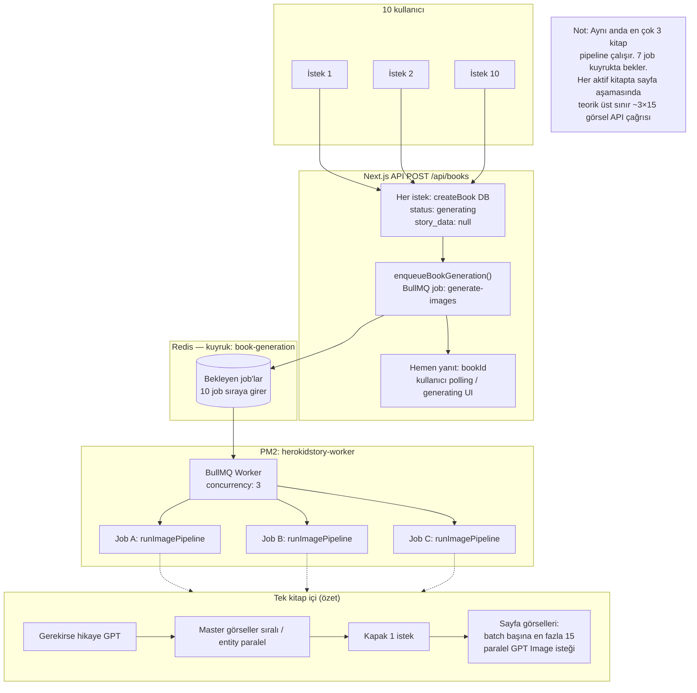

# Kuyruk + worker: kitap oluşturma (BullMQ)

Create Book **fast path**: API kitap kaydı + kuyruk job’u; worker `runImagePipeline` çalıştırır. Detaylı adım sırası: `CREATE_BOOK_FLOW_SEQUENCE.md`.

## İlgili dokümanlar ve kod

| Konu | Dosya |
|------|--------|
| Adım sırası, TTS paralelliği, sayfa batch (15) | `docs/analysis/CREATE_BOOK_FLOW_SEQUENCE.md` |
| Redis + PM2 web + worker kurulum | `docs/implementation/FAZ0_REDIS_PM2.md` |
| Sunucuda worker kontrolü | `docs/checklists/EC2_DEPLOY_POST_PULL_2026.md` |
| Kuyruk adı, `enqueueBookGeneration` | `lib/queue/client.ts` |
| Worker concurrency, job işleyici | `lib/queue/workers/book-generation.worker.ts` |
| Görsel pipeline (masters → kapak → sayfa batch) | `lib/book-generation/image-pipeline.ts` |
| Fast path: DB + kuyruk | `app/api/books/route.ts` (~satır 884–958) |

## Mermaid — çok kullanıcı aynı anda kitap istedi

### Kısa yorum

- **Job:** Her kitap için Redis’te bir BullMQ job (`generate-images`); payload’da `bookId`, `characterIds`, tema vb.
- **Worker:** Tek worker süreci, **eşzamanlı en fazla 3 job** (`concurrency: 3`).
- **GPT Image paralelliği:** Kitaplar arası değil, **tek kitap içinde** sayfa üretiminde batch başına **15 paralel** istek (`image-pipeline.ts`, `BATCH_SIZE = 15`).
- **Debug / pre-generated story:** `route.ts` içinde bu fast path atlanıp uzun senkron yol kullanılabilir; prod varsayılanı yukarıdaki gibi.
